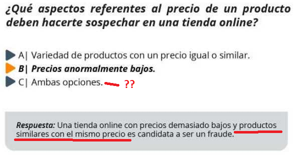
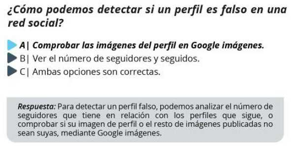
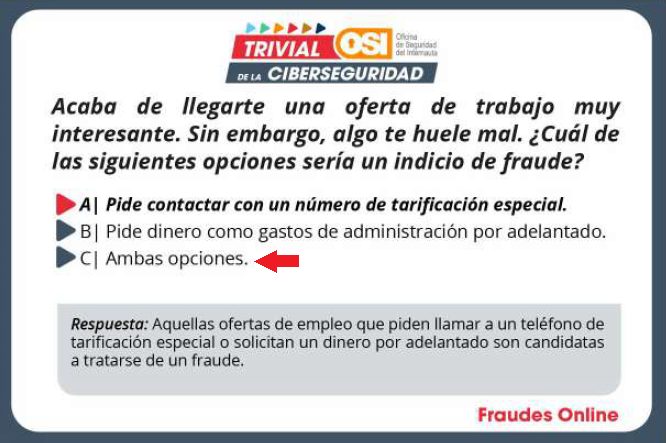
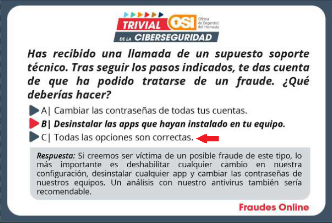
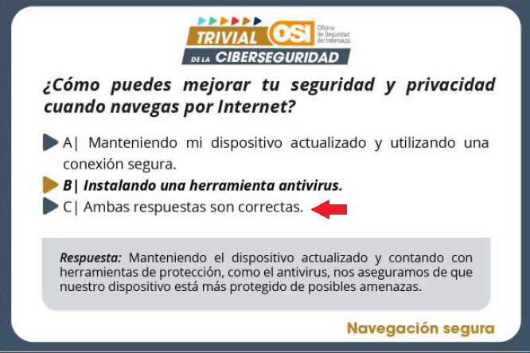
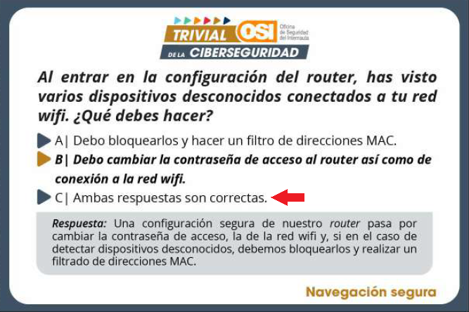

# 🔊 🧀 🛡️ alexa-skill-trivial-ciberseguridad
Versión Alexa del trivial de la ciberseguridad. Preguntas creadas por la Oficina de la Seguridad del Internauta (OSI) de INCIBE.

Skill Alexa creada utilizando la plantilla "Alexa Skills Clean Code Template": <https://github.com/javichur/alexa-skill-clean-code-template>

Las preguntas del Trivial han sido elaboradas por OSI de INCIBE: <https://www.osi.es/es/campana/trivial-de-la-ciberseguridad>

## 🐛 Erratas detectadas en el trivial original

Durante la creación de esta skill se ha detectado posibles errores en el **10% de las preguntas** del trivial de INCIBE. La aclaración que aparece en cada tarjeta de trivial es correcta, pero ellos marcan en negrita una respuesta que creo no es la correcta. Ejemplos (esta Alexa skill dará por buena la opción corregida en rojo):

 

