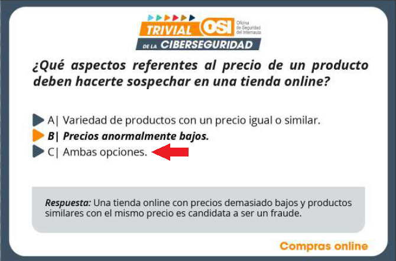
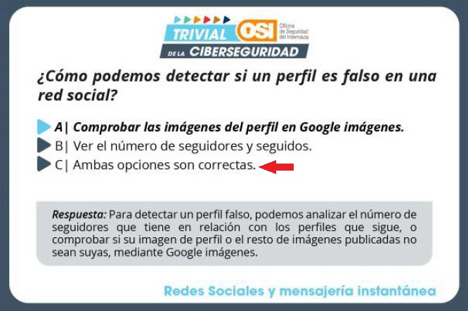

# 🔊 🧀 🛡️ alexa-skill-trivial-ciberseguridad


Versión para Alexa del **Trivial de la Ciberseguridad**. Preguntas creadas por la [Oficina de la Seguridad del Internauta (OSI) de INCIBE](https://www.osi.es/es/campana/trivial-de-la-ciberseguridad).

Skill Alexa creada utilizando la plantilla ["Alexa Skills Clean Code Template"](https://github.com/javichur/alexa-skill-clean-code-template).

---

## ❓ 60 preguntas sobre...

- 💬 Redes sociales y mensajería instantánea.

- 🔑 Gestión de contraseñas.

- 🛒 Compras online.

- 💸 Fraudes online.

- 🌐 Navegación segura.

- 📱 Protección de dispositivos.

Si quieres utilizar las preguntas en otro proyecto, recuerda citar a la fuente original (OSI de INCIBE). Puedes encontrar las preguntas en el [PDF original](./original/osi-trivial-ciberseguridad.pdf) o en formato [JSON en esta skill](./lambda/custom/data/preguntas-trivial.js). 

Si añades nuevas preguntas y quieres comprobar que las preguntas están en formato correcto, ejecuta el comando:

```
npm run check-preguntas
```

---

## 📬 Feedback

Si encuentras algún error, si tienes alguna sugerencia de mejora o si este código te sirve para crear tu próxima súper app, por favor [escríbeme](https://github.com/javichur/alexa-skill-trivial-ciberseguridad/issues) 🙂.

---

## 🐛 Erratas detectadas en el trivial original

Durante la creación de esta skill se ha detectado **posibles errores en el 10% de las preguntas** del trivial de INCIBE. La aclaración que aparece en cada tarjeta de trivial es correcta, pero ellos marcan en negrita una respuesta que creo no es la correcta. Ejemplos (esta Alexa skill dará por buena la opción corregida en rojo):

 



